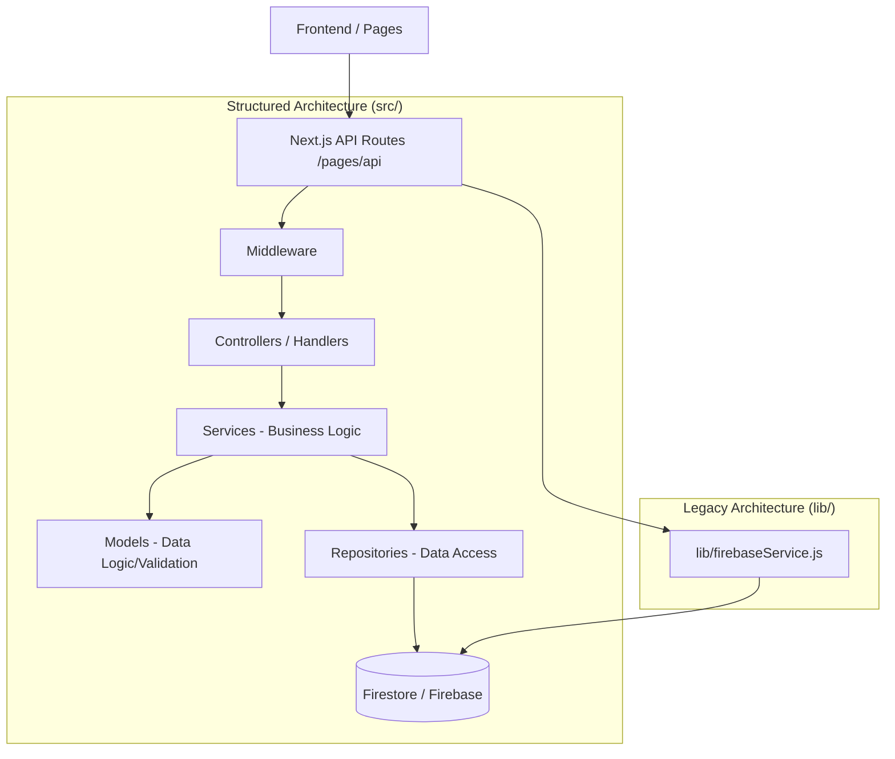

# Logam Task Manager - Architecture Overview

This document provides a high-level overview of the Logam Task Manager's software architecture, explaining how the project is structured, how data flows through the system, and the ongoing transition to a modern MVC (Model-View-Controller) pattern.

## System Architecture

The project is currently in a **hybrid/transition state**. It is migrating from a traditional flat structure (driven by `lib/` and direct API handlers in `pages/api/`) to a structured MVC architecture located in the `src/` directory.

### High-Level Structure

---

## The `src/` Folder Explained

The `src/` folder contains the new core logic of the application, organized into distinct layers for better maintainability and scalability.

### 1. Models (`src/models/`)
**Responsibility**: Defines the structure of data and validation rules.
- Contains classes or schemas that represent entities (User, Attendance, Task).
- Handles data transformation (e.g., sanitizing output to remove passwords).

### 2. Repositories (`src/repositories/`)
**Responsibility**: The "Data Access Layer".
- Wraps all database interactions (Firestore).
- Provides a clean interface so the rest of the app doesn't need to know about Firebase specifics.
- **Auto-Mapping**: Handles compatibility between database field names (e.g., `clockIn`) and frontend names (e.g., `checkIn`).

### 3. Services (`src/services/`)
**Responsibility**: The "Business Logic Layer".
- This is where the actual "work" happens (calculating hours, checking permissions, orchestrating multiple database updates).
- Services use Repositories to get data and Models to validate it.
- **Rule**: Always call a service from an API route, never call a repository directly.

### 4. Middleware (`src/middleware/`)
**Responsibility**: Request Pre-processing.
- Handles Authentication (JWT verification).
- Role-Based Access Control (Admin vs. User permissions).
- Multi-tenancy isolation (ensuring Org A cannot see Org B's data).
- Centralized error handling via `asyncHandler`.

### 5. Utils (`src/utils/`)
**Responsibility**: Global helpers.
- Standardized response formats (`successResponse`, `errorResponse`).
- Global constants and custom error classes.

---

## Data Flow Pattern

When a request is made (e.g., a "Clock Out" action):

1.  **Request**: Frontend calls `/pages/api/attendance/clock-out.js`.
2.  **Auth (Middleware)**: The request passes through `authenticate` middleware to verify the user's identity and tenant.
3.  **Service**: The handler calls `attendanceService.markAttendance()`.
4.  **Logic**: The Service calculates hours worked, updates the daily log, and validates the state using `AttendanceModel`.
5.  **Repository**: The Service calls `attendanceRepository.update()` to persist changes to Firestore.
6.  **Response**: The result is returned through a standardized Utility helper to the frontend.

---

## Key Concepts

### Multi-Tenancy & Isolation
Everything in the system is isolated by `tenantId`. Services and Repositories are designed to always require a `tenantId` to ensure data security between different organizations.

### Backward Compatibility
The new layer in `src/` is built to be backward compatible. It supports both legacy field names and new structured ones, allowing the frontend to be updated gradually.

---

## Maintenance Guidelines
- When adding new features, follow the MVC pattern in `src/`.
- Avoid adding new logic to the legacy `lib/` folder.
- Use the `asyncHandler` middleware for all new API routes to ensure consistent error reporting.
